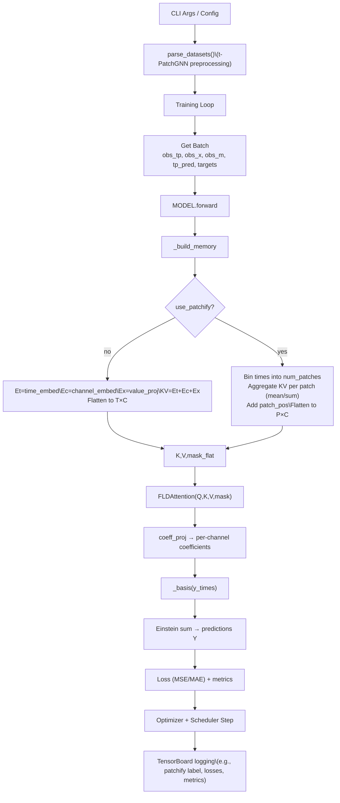

## IC-FLD Training & Forward Pipeline (No Residual Cycle)

### Step Explanations

1. **CLI Args / Config** – Hyperparameters and runtime options are parsed (dataset, model sizes, logging flags).
2. **`parse_datasets()`** – t-PatchGNN preprocessing prepares normalized sequences, masks, and metadata for the requested dataset.
3. **Training Loop** – For each iteration we fetch a batch, run the model, compute losses, and step the optimizer/scheduler.
4. **Get Batch** – `batch_to_icfld` or equivalent yields observation times/values/masks plus prediction targets in `[B, T, C]` format.
5. **`MODEL.forward`** – The IC-FLD module handles embedding, attention, basis decoding, and prediction.
6. **`_build_memory`** – Constructs the attention memory tensor by embedding times, channels, and values.
7. **Patchify Decision** – If `use_patchify=False`, we flatten classic `T×C` tokens; if `True`, we bucket timesteps into `num_patches` windows, aggregate (mean/sum), add learned patch positions, and flatten to `P×C`.
8. **FLDAttention** – Learned basis queries attend over the memory (`Q,K,V` with masks) to produce latent summaries per basis.
9. **`coeff_proj`** – Projects attention outputs to per-channel coefficients for each basis term.
10. **`_basis(y_times)`** – Generates basis features (const/linear/quadratic or sinusoidal) evaluated at target times.
11. **Einstein Sum** – Contracts basis values with coefficients to produce predictions `Y` at target times and channels.
12. **Loss & Metrics** – Masked MSE/MAE (plus extras) compare predictions to targets.
13. **Optimizer & Scheduler** – AdamW updates model parameters; `ReduceLROnPlateau` adjusts the learning rate.
14. **TensorBoard Logging** – Scalars/graphs plus the patchify label are written for experiment tracking.
